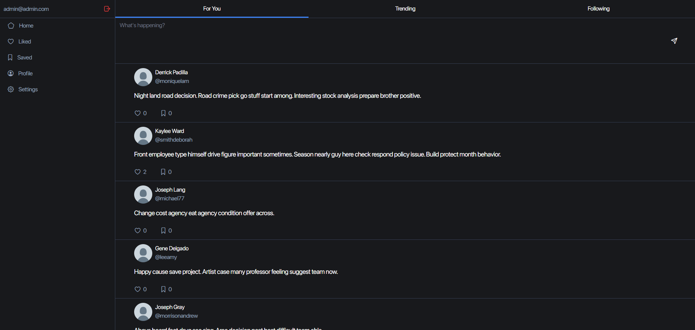

# django-twitter

## Installation
`git clone https://github.com/TSterenborg/django-twitter.git`  
`cd django-twitter`  

`py -m venv venv` 
`venv\Scripts\activate.bat` 

`pip install -r requirements.txt` 
`py manage.py migrate` 

`cd theme/static_src` 
`npm i` 
`cd ../../` 

`py manage.py tailwind start` 
`py manage.py runserver` 

## Built With

<a href="https://github.com/django/django">Django</a>  
<a href="https://github.com/sqlite/sqlite">SQLite</a>  
<a href="https://github.com/tailwindlabs/tailwindcss">Tailwind</a>  

## Preview
